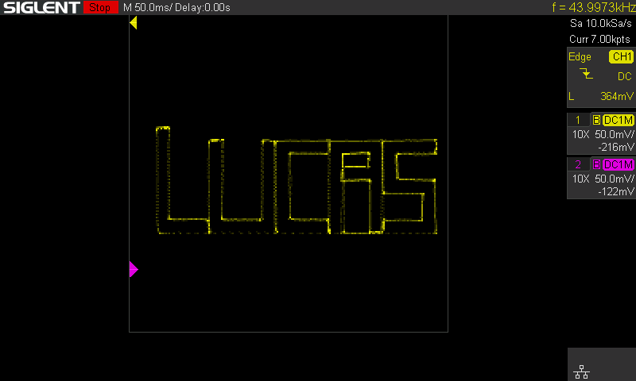

# Drawing on an Osscilloscope
This is a short and simple program to draw something on an oscilloscope. I got the idea from W2AEW who I believe got it from JohnGineer. I addapted the code to write my name instead. I have uploaded a screen dump from my oscilloscope (which i got from my Lab_Automation Script ;) ) and have posted it here. The quality is very poor on my digital scoope compared to others I have seen on Analog scopes. One big downside is that my scope cannot draw vectors in XY mode so none of the dots are conncted.

# Scope Settings:  
- XY mode  
- ERES mode enhanced by 2.5 bits    
- 20M bandwitdh limit for X & Y channel   
- 7K memory limit  
- 50 mV/div each channel and 50ms/Div  

These settings gave me the best results which were still pretty mediocre

# Hardware Used 
- Arrduino Uno 
- 2x 10k resistor
- 2x 100nF ceramic capacitor

I am going to play around with the filter values and see if that will help the quality of the image

